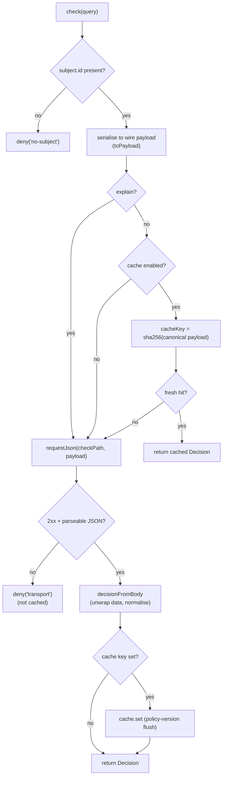
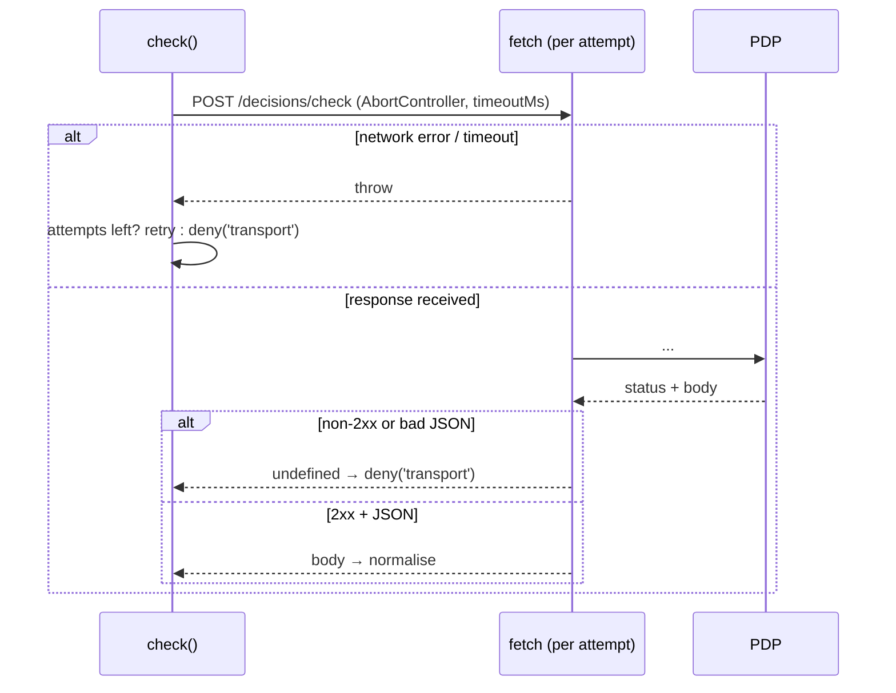

This page traces a single `check()` from call to verdict, naming every branch where the flow can divert to a deny. It's the runtime companion to the [Architecture overview](/architecture/overview).

## The full path

## Step by step

::: steps

1. **Subject guard**
   A query with no `subject.id` is denied immediately — `deny('no-subject')` — without touching the network. No subject, no decision.

2. **Serialise the payload**
   `toPayload(query)` builds the exact wire body: `subject.type` defaulted to `user`, `current_aal` snake-cased (default `aal1`), `organization`/`application`/`resource` defaulted to `null`, `context` to `{}`, `explain` to a boolean. Every key is present — nulls included — matching the PHP client's `DecisionRequest::toArray()`. See [Wire contract](/architecture/wire-contract).

3. **Cache read (skipped for explain)**
   If `explain: true`, the cache is bypassed entirely. Otherwise, if caching is enabled, the SDK computes the `cacheKey` (a SHA-256 over the canonicalised payload) and returns a fresh hit verbatim. A miss falls through to the network.

4. **HTTP with timeout and retry**
   `requestJson` POSTs the payload to `{baseUrl}/{checkPath}` with `Accept` / `Content-Type: application/json` and, if configured, `Authorization: Bearer`. An `AbortController` enforces `timeoutMs` (default 2000). On a **network error / timeout / abort** the call retries up to `retries` times (idempotent errors only). A **non-2xx** response or an **unparseable body** returns `undefined` immediately — never retried.

5. **Transport failure → deny (uncached)**
   If `requestJson` returned `undefined`, the flow yields `deny('transport')`. Crucially this synthetic deny is **not** written to the cache — it must not outlive the outage that caused it.

6. **Normalise**
   `decisionFromBody` unwraps a single `{ data }` envelope if present, then reads each field through a type guard with a safe default (missing `allowed` → `false`). The result is a typed `Decision`.

7. **Cache write (with policy-version flush)**
   If a cache key was computed, the verdict is stored for `ttlMs`. If its `policyVersion` exceeds the highest seen, the whole cache is flushed first — a policy change invalidates everything cached under the old one.

8. **Return**
   The `Decision` is returned. `can()` wraps this whole flow and applies `isGranted` (`allowed && !requiresStepUp`) to reduce it to the fail-safe boolean.

:::

## Timeouts and retries

The timeout is **per attempt**, enforced by aborting the `fetch`. Retries apply **only** to idempotent network-level failures (the request may never have reached the server), never to a 4xx/5xx — a server that answered, even with an error, has spoken, and re-asking won't change the verdict. This mirrors the PHP client's `http_errors => false` semantics: HTTP error statuses are data (→ deny), not exceptions to retry.

## The verifyToken flow (for contrast)

`verifyToken` follows a parallel but distinct path: it requires an audience up front, resolves the JWKS (cached 10 min, refetched once on a key-resolution miss), then verifies signature + claims. Unlike `check`, it **rejects** rather than returning a deny value — because a token failure has no safe "value". See [Token verification theory](/concepts/token-verification).

## Next steps

- [Wire contract](/architecture/wire-contract) — the exact payload and response.
- [Caching decisions](/guides/caching) — the cache read/write in detail.
- [The decision model](/concepts/decision-model) — normalisation rules.
