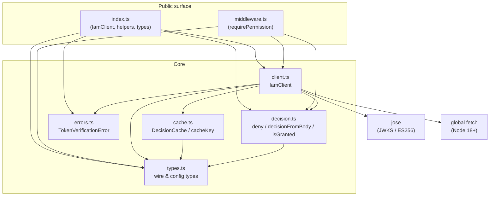
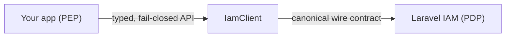

This is the map of the SDK. It's deliberately small — a thin client has few moving parts — but each part exists to uphold the same invariant. This page shows how they fit; the deep pages cover each in detail.

## The design premise

> **The PDP owns every decision. The SDK owns only the wire, the normalisation, and the fail-closed funnel.**

There is no authorization logic in this package. It does not interpret grants, evaluate conditions, or resolve relationships. It serialises a query to the canonical wire format, calls the server, normalises the answer, and — on any uncertainty — denies. That boundary is what makes it a faithful, drop-in equivalent of the PHP client in another language.

## The module map

## What each module does

| Module | Responsibility |
| --- | --- |
| **`client.ts`** | `IamClient` — the heart. `check`, `can`, `listResources`, `verifyToken`, plus the private HTTP/JWKS internals. Owns timeouts, retries, Bearer auth, the `{ data }` unwrap, and JWKS caching/rotation. |
| **`decision.ts`** | Pure functions: `deny()` (the single fail-closed sink), `decisionFromBody()` (safe normalisation), `isGranted()` (the granted reduction). No I/O. |
| **`cache.ts`** | `DecisionCache` (opt-in TTL store that can't turn deny→allow, with policy-version flush) and `cacheKey()` (stable SHA-256 over the canonical query). |
| **`errors.ts`** | `TokenVerificationError` — the one thrown type, used only by `verifyToken`. |
| **`middleware.ts`** | `requirePermission()` — the Express/Fastify PEP. Resolves subject/resource/context, gates on `isGranted`, fails closed (incl. catching its own serialisation throws). |
| **`types.ts`** | The wire and config types — `Subject`, `Resource`, `DecisionQuery`, `Decision`, `Claims`, `IamClientConfig`, etc. The contract, in TypeScript. |
| **`index.ts`** | The public barrel: exports `IamClient`, the decision helpers, `TokenVerificationError`, and every type. Middleware ships on the `./middleware` subpath. |

## The two boundaries

The SDK sits between two boundaries it never crosses:

- **Upward, toward your app:** it exposes a typed, fail-closed API and never throws from `check`/`can`/`listResources`. Your app is the PEP; the SDK is its wire.
- **Downward, toward the PDP:** it speaks the exact canonical contract (slash endpoint, snake-case `current_aal`, `{ data }` envelope, Bearer auth) so the server treats it identically to the PHP client.

## The single connecting rule

Every module bends to one invariant: **uncertainty resolves to deny.** It shows up everywhere —

- `client.requestJson` returns `undefined` (→ deny) on any transport failure;
- `decision.deny` is the sole constructor for an error verdict;
- `decisionFromBody` defaults missing fields to the safe value;
- `cache` refuses to store transport-error denies and flushes on policy bumps;
- `middleware` catches its own throws and 403s;
- `verifyToken` rejects when audience is absent.

Read [Fail-closed by design](/concepts/fail-closed) for the theory; this page is just where the modules hang it.

## Standalone & parity guarantees

- **No framework dependency.** The middleware works on Express and Fastify through a structural request/response interface, taking a hard dependency on neither.
- **Minimal deps.** Only `jose` at runtime; transport is native `fetch`. ESM + CJS + types ship together.
- **PHP parity.** The wire types mirror the PHP client's `HttpDecider`/`DecisionRequest`/`IamDecision` byte-for-byte, so the server can't distinguish a Node caller from a PHP one.

## Next steps

::: grids
  ::: grid
    ::: card "Decision flow" icon:workflow
    The end-to-end lifecycle of a `check()` call, step by step.

    [Open →](/architecture/decision-flow)
    :::
  :::
  ::: grid
    ::: card "Wire contract" icon:file-code
    The exact request/response bytes the SDK speaks.

    [Open →](/architecture/wire-contract)
    :::
  :::
  ::: grid
    ::: card "ADR" icon:scale
    The load-bearing decisions and their trade-offs.

    [Open →](/architecture/decisions)
    :::
  :::
:::
