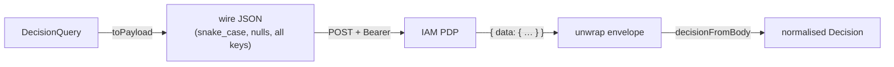

The SDK's value is parity: it speaks the **canonical decision contract** byte-for-byte with the PHP client, so the IAM server cannot tell a Node caller from a PHP one. This page documents that contract exactly.

## Endpoints

| Operation | Method + path | Default path constant |
| --- | --- | --- |
| Permission check | `POST {baseUrl}/decisions/check` | `decisions/check` |
| ReBAC list-resources | `POST {baseUrl}/decisions/list-resources` | `decisions/list-resources` |
| JWKS | `GET {origin}/.well-known/jwks.json` | derived from origin |

::: callout warning "It's the slash form, not the colon form"
The endpoint is `decisions/check` (a path segment), **not** the older `decisions:check` colon form. Every IAM SDK and the PHP client are aligned on the slash form. Both `checkPath` and `listResourcesPath` are overridable on the client for forward compatibility, but the defaults are canonical.
:::

`baseUrl` includes the API prefix (`…/api/iam/v1`); the JWKS URL is derived from the **origin** because keys live at the server root, not under the prefix.

## Request headers

```http
POST /api/iam/v1/decisions/check HTTP/1.1
Host: iam.example.com
Accept: application/json
Content-Type: application/json
Authorization: Bearer <service token>
```

`Authorization` is sent only when a `token` is configured. JWKS fetches send just `Accept: application/json` — verifying a token needs no service credential, only the public keys.

## Request body

`toPayload()` serialises a `DecisionQuery` into this exact shape. Every key is **always present** — defaults fill the gaps — matching the PHP client's `DecisionRequest::toArray()`:

```json
{
  "subject": { "type": "user", "id": "usr_123" },
  "permission": "stock.adjust",
  "organization": null,
  "application": "warehouse",
  "resource": { "type": "warehouse", "id": "wh_milan" },
  "context": { "amount": 300 },
  "current_aal": "aal1",
  "explain": false
}
```

| Field | Source | Default on the wire |
| --- | --- | --- |
| `subject.type` | `query.subject.type` | `"user"` |
| `subject.id` | `query.subject.id` | — (required; no id ⇒ deny before any request) |
| `permission` | `query.permission` | — |
| `organization` | `query.organization` | `null` |
| `application` | `query.application` | `null` |
| `resource` | `query.resource` | `null` |
| `context` | `query.context` | `{}` |
| `current_aal` | `query.currentAal` | `"aal1"` |
| `explain` | `query.explain` | `false` |

::: callout tip "Two parity details that matter"
**`current_aal` is snake-case** on the wire even though the TypeScript field is `currentAal` (camelCase) — the serialiser bridges them. And **nulls are sent explicitly**, not omitted: the PDP receives a fully-populated object every time. Both match the PHP client exactly.
:::

## Response body

The server wraps successful responses in a `{ "data": { … } }` envelope (its `AdminController::ok()` convention):

```json
{
  "data": {
    "allowed": true,
    "decision_id": "dec_01HX…",
    "policy_version": 42,
    "requires_step_up": false,
    "required_aal": null,
    "matched": [ { "type": "role", "key": "warehouse.operator" } ],
    "explanation": []
  }
}
```

The SDK unwraps a **single** `data` envelope transparently: if the top-level object lacks `allowed` but has a nested `data` object, fields are read from `data`; otherwise they're read from the top level. Both shapes normalise to the same `Decision`. Field-by-field normalisation (with safe defaults) is covered in [The decision model](/concepts/decision-model).



## list-resources contract

```json
// request
{ "subject": { "type": "user", "id": "usr_123" }, "relation": "manage" }

// response (envelope unwrapped)
{ "data": { "resources": [ { "type": "warehouse", "id": "wh_milan" } ] } }
```

The SDK reads `data.resources`, keeps only entries shaped `{ type: string, id: string }`, and returns `[]` on any error. See [ReBAC list-resources](/guides/list-resources).

## Why parity is the whole point

The wire types mirror the PHP client's `HttpDecider` / `DecisionRequest` / `IamDecision`. That isn't incidental — it's the contract that lets one IAM server serve a polyglot fleet (PHP, Node, React Native, Rust) with **one** policy engine and **one** audit trail. A drift in casing, envelope handling, or null treatment would make a Node caller subtly different from a PHP caller, splitting the contract. Keeping them identical keeps the server's view of the world coherent.

## Next steps

- [The decision model](/concepts/decision-model) — how the response normalises.
- [Decision flow](/architecture/decision-flow) — where serialisation sits in the lifecycle.
- [Types](/reference/types) — the TypeScript side of this contract.
