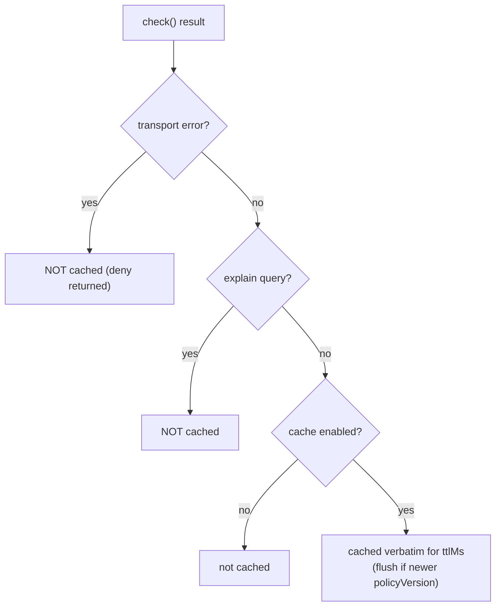

The decision cache trades a little freshness for fewer PDP round-trips. Done right, it relieves load without ever weakening authorization. This page is the discipline for "done right".

## The core asymmetry

The cache's safety rests on one asymmetric property:

> **The cache can make a stale _allow_ linger (bounded by `ttlMs`). It can never invent an _allow_, and it never makes a _deny_ outlive the truth.**

Why the asymmetry is safe to live with:

- It **never caches transport-error denies**, so an outage's synthetic deny can't be served later as if real.
- It **stores only the server's verdict verbatim** — there is no code path that turns a deny into an allow.
- It **flushes on a newer `policyVersion`**, so a policy change (which might revoke a grant) zeroes the cache immediately.

The only residual risk is temporal: a grant revoked on the server can still be served from cache until the entry expires or a policy bump flushes it. That window is exactly `ttlMs` — which you control.

$$
\text{max staleness of an allow} = \min(\text{ttlMs},\ \text{time to next policy bump})
$$

## Choosing a TTL

Treat `ttlMs` as a dial between **load relief** and **revocation latency**:

| TTL | Load relief | Revocation latency | Good for |
| --- | --- | --- | --- |
| 0 (off) | none | instant | sensitive writes; low traffic |
| 1–5 s | high on bursty hot paths | a few seconds | read-heavy endpoints, repeated identical checks |
| 10–60 s | very high | up to a minute | low-sensitivity, high-volume reads |

::: callout tip "Match TTL to sensitivity, not just traffic"
A high-traffic endpoint guarding a low-stakes read can tolerate a longer TTL. A low-traffic endpoint guarding money movement should use a very short TTL or none. Size the dial by **blast radius of a stale allow**, not by request rate alone.
:::

## What is cached, precisely

- **Real verdicts only** — allow or deny that the server actually returned.
- **Never** transport-error denies (they must not outlive the outage).
- **Never** `explain` queries (reasoning must be fresh, and is per-subject).

## The cache key includes everything that changes the verdict

The key is a SHA-256 over the canonicalised payload — subject, permission, organization, application, resource, **context**, and **current_aal**. So two queries that differ only in `context.amount` or in `currentAal` cache separately. You cannot accidentally serve a low-amount allow to a high-amount request, or an `aal2` allow to an `aal1` caller. This mirrors the PHP client's `DecisionRequest::cacheKey()`.

## Memory bounds

`maxEntries` (default 1000) caps the store; past the cap the oldest inserted key is evicted. In a service touching many distinct subjects/resources, keep the cap sized to your working set so hot keys aren't evicted prematurely, but not so large that memory grows unbounded.

## Anti-patterns

::: callout warning "Don't do these"
- **Long TTLs on sensitive permissions.** A 60-second cache on `money.transfer` means a revoked grant can still move money for a minute. Use 0 or a very short TTL there.
- **Treating a cache hit as authoritative across a deploy.** It is — the policy-version flush handles real policy changes — but don't add your own layer of caching on top that lacks the flush.
- **Caching `explain` results yourself.** They're deliberately uncached; re-caching them defeats the freshness guarantee.
- **Assuming the cache makes you fail-open-tolerant.** It reduces how often you hit the PDP, but the SDK is still fail-closed: a miss during an outage denies. The cache smooths blips, it doesn't grant during outages.
:::

## When to leave it off

If your traffic isn't repetitive (every check is a distinct subject/resource/context), the hit rate is near zero and the cache only adds memory and a hashing cost. The cache pays off when the **same** decision is asked repeatedly in a short window — a list view re-checking the same permission, a burst of requests from one session. Measure your hit rate before tuning the TTL up.

## Next steps

- [Caching decisions](/guides/caching) — the how-to and config.
- [Fail-closed by design](/concepts/fail-closed) — the invariant the cache must respect.
- [The decision model](/concepts/decision-model) — `policyVersion` and the verdict shape.
