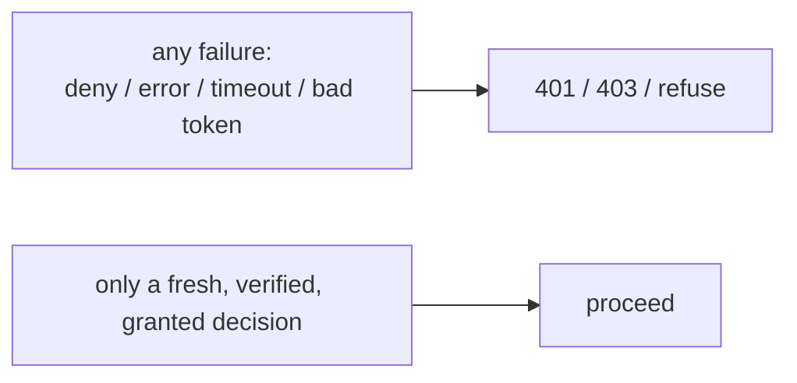

The SDK is fail-closed inside its own boundary. But you can undo that in a single line of your code. This page is the checklist that keeps the invariant true end to end.

## 1. Gate on `granted`, never on raw `allowed`

The single most common mistake. A step-up-pending decision has `allowed: true` but is **not** safe to act on.

::: callout danger "Wrong"
```ts
const d = await iam.check(query);
if (d.allowed) doIt(); // ❌ performs step-up-gated actions without the step-up
```
:::

::: callout success "Right"
```ts
if (await iam.can(query)) doIt();         // ✅ folds in requiresStepUp
// or, with a decision in hand:
if (isGranted(d)) doIt();                  // ✅
```
:::

## 2. Treat every `verifyToken` rejection as a hard deny

A thrown `TokenVerificationError` means **nothing** about the token is trustworthy. Don't log-and-continue, and don't fall back to reading the unverified payload.

::: callout danger "Wrong"
```ts
let claims;
try { claims = await iam.verifyToken(jwt, { audience }); }
catch { claims = decodeWithoutVerifying(jwt); } // ❌ trusts an unverified token
```
:::

::: callout success "Right"
```ts
try {
  const claims = await iam.verifyToken(jwt, { audience });
  // proceed only here
} catch {
  return res.status(401).end(); // ✅ hard stop
}
```
:::

## 3. Always supply an audience

`verifyToken` rejects without one — by design. Set it once as a client default so you can't forget:

```ts
const iam = new IamClient({ baseUrl, verify: { audience: 'warehouse' } });
```

Override per call only when a service legitimately accepts multiple audiences. Never work around the requirement.

## 4. Order: authenticate, then authorize

Authentication (who are you?) must precede authorization (may you?). Put `verifyToken`-based auth **before** `requirePermission`, so the authz layer has a verified subject:

```ts
app.use(authenticate(iam, 'warehouse'));        // sets req.user from verified claims
app.post('/stock', requirePermission(iam, 'stock.adjust'), handler);
```

If authentication leaves the subject unset, `requirePermission` denies with 403 — which is correct, but you generally want the 401 from the auth layer first.

## 5. Don't treat `listResources` `[]` as a positive assertion

An empty list can mean "no relationships" **or** "the PDP was unreachable". Use it to show **fewer** resources, never to conclude the subject has no access — and re-check writes with `can()`. See [ReBAC list-resources](/guides/list-resources).

## 6. Set a sane timeout, and consider idempotent retries

The default `timeoutMs` is 2000. Tune it to your latency budget — too long and a PDP blip stalls requests; too short and healthy calls fail closed needlessly. For transient network errors, a small `retries` value (1–2) smooths blips **without** weakening anything: retries apply only to idempotent network failures, never to a 4xx/5xx.

```ts
const iam = new IamClient({ baseUrl, token, timeoutMs: 1500, retries: 1 });
```

## 7. Use the cache to ride out blips — but keep TTLs short for sensitive actions

A short decision cache reduces how often hot paths hit the PDP, so a brief outage denies fewer requests. Keep `ttlMs` small (seconds) for sensitive permissions so a just-revoked grant doesn't linger. The cache can never invent an allow — but it can let a stale one survive up to `ttlMs`. See [Caching safely](/best-practices/caching-safely).

## 8. Don't catch-and-allow anywhere

The umbrella rule: there is no legitimate place in your code to respond to an authorization or verification failure by **allowing**. Every failure — denied, unreachable, malformed, unverifiable — ends in a 401/403 or an equivalent refusal.



## Checklist

::: callout tip "Before you ship"
- [ ] Gates use `can()` / `isGranted`, not raw `allowed`.
- [ ] `verifyToken` is always given an audience; rejections are hard stops.
- [ ] Auth runs before authz; the subject is the verified `sub`.
- [ ] `listResources` `[]` filters display only; writes are re-checked.
- [ ] `timeoutMs` matches your budget; `retries` only for idempotent blips.
- [ ] Cache TTLs are short for sensitive permissions.
- [ ] No `catch` anywhere resolves to allow.
:::

## Next steps

- [Fail-closed by design](/concepts/fail-closed) — the theory behind this checklist.
- [Caching safely](/best-practices/caching-safely) — the cache trade-offs.
