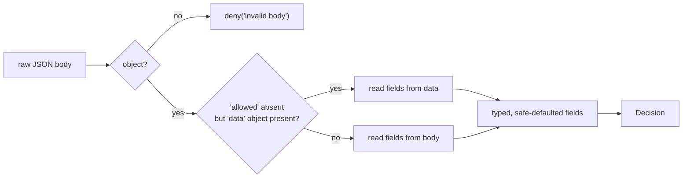

A `Decision` is the SDK's normalised view of the PDP's answer. This page defines it precisely: where each field comes from, how a hostile or truncated response degrades safely, and how the verdict reduces to the one boolean you gate on.

## The shape

```ts
interface Decision {
  allowed: boolean;          // the PDP's raw verdict
  decisionId: string;        // server id for audit correlation ('' if absent)
  policyVersion: number;     // monotonic server policy version (0 if absent)
  requiresStepUp: boolean;   // allowed only at a higher AAL
  requiredAal: string | null;// the AAL needed if step-up pending
  matched: DecisionMatch[];  // policy elements the PDP matched
  explanation: string[];     // human-readable reasoning (with explain:true)
}
```

This mirrors, field for field, the PHP client's `IamDecision`. Keeping the shape identical is what makes the SDK a drop-in equivalent — the same server response normalises to the same structure in either language.

## Building it from the wire

The raw response is JSON. `decisionFromBody()` turns it into a `Decision` under a strict rule: **anything missing or wrong-typed degrades to its safe value.** This is the normalisation contract:

| `Decision` field | Source key | Type guard | Safe default |
| --- | --- | --- | --- |
| `allowed` | `allowed` | `=== true` | `false` |
| `decisionId` | `decision_id` | `string` | `''` |
| `policyVersion` | `policy_version` | `number` | `0` |
| `requiresStepUp` | `requires_step_up` | `=== true` | `false` |
| `requiredAal` | `required_aal` | `string` | `null` |
| `matched` | `matched` | array of objects | `[]` |
| `explanation` | `explanation` | array of strings | `[]` |

Note the asymmetry on the booleans: `allowed` and `requiresStepUp` are only `true` when the server sends **exactly** `true`. A `1`, a `"true"`, a missing key — all become `false`. The safe direction for `allowed` is `false`; the safe direction for `requiresStepUp` is also `false` only because an absent step-up requirement means "no extra friction", and a malformed one shouldn't silently grant. The verdict still can't be permissive unless `allowed` is genuinely `true`.



## The `{ data }` envelope

The IAM server wraps successful responses in `{ "data": { … } }` (the convention of its `AdminController::ok()`). The SDK unwraps a **single** `data` envelope transparently: if the top-level object has no `allowed` key but does have a nested `data` object, it reads the fields from `data`. A response that already has `allowed` at the top level is read directly. Either wire shape normalises to the same `Decision`. See [Wire contract](/architecture/wire-contract).

## The granted reduction

The model deliberately separates the **raw verdict** (`allowed`) from the **safe-to-act predicate** (`granted`):

$$
\text{granted}(\text{d}) \iff \text{d.allowed} \;\land\; \lnot\,\text{d.requiresStepUp}
$$

`isGranted(decision)` computes exactly this, and `can()` is `isGranted(await check())`. The reason for the split is step-up: a decision can be `allowed: true, requiresStepUp: true`, which means _"permitted, but only after a higher-assurance challenge"_ — present-tense, **not** something to act on. Gating on `granted` collapses that nuance into the one correct boolean. See [Step-up & AAL](/concepts/step-up-aal).

## DecisionMatch and explanation

- `matched` is the list of policy elements (roles, conditions, relationships) the PDP matched while reaching its verdict — `{ type?, key?, … }` entries, useful for audit and debugging.
- `explanation` is human-readable reasoning, populated when you pass `explain: true`. It's also where synthetic denies leave a breadcrumb: a no-subject deny carries `['no-subject']`, a transport deny `['transport']`. Read it for observability; never branch authorization on it.

## ADR: normalise instead of passing the raw body through

::: collapsible "ADR — a typed Decision with safe degradation"
**Problem.** Handing callers the raw parsed JSON would couple every call site to the server's exact wire shape and leave each one to handle missing/wrong-typed fields — inconsistently, and often permissively.

**Decision.** Normalise once, in `decisionFromBody`, into a typed `Decision` where every field has a type guard and a safe default, and where the safe default for the verdict is **deny**. Unwrap the `{ data }` envelope here too, so callers never see it.

**Consequences.** Call sites read a stable, typed structure and cannot be surprised by a partial response — a truncated body degrades to a deny, not an exception or a permissive read. The server can evolve its envelope (top-level vs `data`-wrapped) without breaking callers. The cost is one normalisation layer to keep in sync with the server contract, which is exactly the PHP client's contract.
:::

## Next steps

- [Step-up & AAL](/concepts/step-up-aal) — the reason `allowed` ≠ `granted`.
- [Wire contract](/architecture/wire-contract) — the exact request/response bytes.
- [Types](/reference/types) — every interface, annotated.
