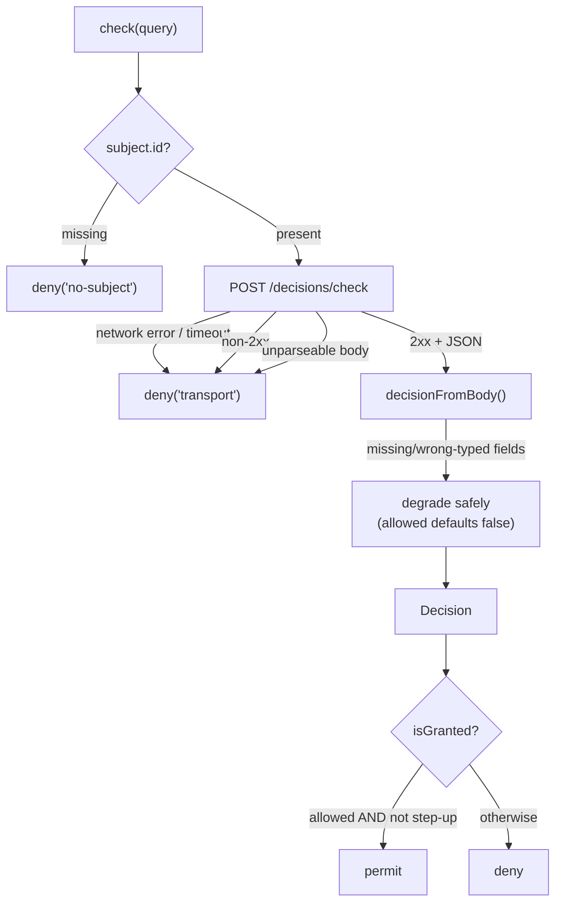

Fail-closed is not a feature of this SDK — it is its **shape**. Every method, every error branch, every default exists to uphold one rule. This page makes that rule precise.

## The invariant

> **A request is permitted only on a positive, fresh, authenticated grant from the PDP. Every other outcome — error, timeout, non-2xx, malformed body, missing subject, unverifiable token, pending step-up — is a denial.**

Formally, let the SDK's effective verdict be $V$. Define the predicate _granted_ as:

$$
\text{granted} \iff \big(\text{PDP responded } 2xx\big) \;\land\; \text{allowed} \;\land\; \lnot\,\text{requiresStepUp}
$$

Then the SDK guarantees:

$$
V = \begin{cases} \textsf{allow} & \text{if } \text{granted} \\ \textsf{deny} & \text{otherwise} \end{cases}
$$

There is no third branch and no fail-open override. The default value of authorization is **deny**, and access is the exception that must be positively earned.

## Why "fail-closed" and not "fail-open"

A **fail-open** system grants access when it cannot reach the authority. It optimises availability of the _feature_ at the cost of the _security boundary_. The failure mode is catastrophic and silent: the moment your PDP has an outage — the exact moment your monitoring is already on fire — every protected action swings open. An incident becomes a breach.

A **fail-closed** system denies access when it cannot reach the authority. Its failure mode is loud and safe: features degrade to "you can't do that right now", users retry, on-call gets paged — but **no unauthorised action is ever permitted**. You trade availability for safety, deliberately, at the one boundary where safety must win.

::: callout danger "Fail-open is an outage-to-breach pipeline"
The dangerous property of fail-open isn't that it's wrong in theory — it's that it converts your **most common** failure (a dependency being briefly unreachable) into your **worst** outcome (unauthorised access), automatically, with no human in the loop. Fail-closed converts the same common failure into a benign one.
:::

## The threat model

Fail-closed defends against this set of realities, none of them exotic:

| Reality | Fail-open outcome | Fail-closed outcome |
| --- | --- | --- |
| PDP is briefly down / deploying | All actions allowed | All actions denied |
| Network blip / DNS hiccup | Allowed | Denied |
| PDP returns 500 / 503 | Allowed (or crash) | Denied |
| PDP returns a truncated/garbage body | Allowed (parsed as permissive) | Denied |
| Caller forgot to set a subject | Allowed (empty subject) | Denied |
| Token minted for another service | Accepted (audience skipped) | Rejected (audience mandatory) |
| Decision allowed but needs step-up | Acted on immediately | Held until step-up |

Every row is a way the system can be _uncertain_. The invariant says: uncertainty resolves to deny.

## How every path funnels to deny

The SDK has exactly one constructor for an allow (a normalised positive decision) and **many** funnels into deny. Concretely:

A few load-bearing details:

- **`deny()` is the single sink.** No-subject, transport failure, malformed body — all build the same explicit deny `Decision` (`allowed: false`, empty everything). It mirrors the PHP client's `IamDecision::deny()`; there is no fail-open opt-out.
- **Normalisation degrades safely.** When the server's body is present but a field is missing or wrong-typed, `decisionFromBody` defaults it to the safe value — a missing `allowed` becomes `false`, not `true`.
- **`check()` never throws.** Throwing would tempt a caller to wrap it in a `try/catch` that "allows on error". By always returning a `Decision`, the only way to read it is to honour the verdict.
- **Synthetic denies are never cached.** A deny born of an outage must not outlive it; the cache refuses to store transport-error denies.
- **The middleware catches its own throws.** Even a circular-`context` `JSON.stringify` throw is converted to a 403, not an unhandled rejection that bypasses the gate.

## ADR: never throw from `check()`

::: collapsible "ADR — check() returns a Decision and never throws"
**Problem.** An authorization call can fail for transport reasons. If it signals failure by throwing, callers will write `try { if (await check()) … } catch { /* ??? */ }` — and under deadline pressure the catch block tends to either swallow-and-continue (fail-open) or duplicate the deny logic inconsistently.

**Decision.** `check()` (and `can()`, `listResources`) never throw. Every failure is folded into the return value: a deny `Decision` for `check`, `false` for `can`, `[]` for `listResources`. Only `verifyToken` rejects — because a token failure has no safe "value", and rejection is the unambiguous deny signal there.

**Consequences.** Callers cannot accidentally fail open by mishandling an exception, because there is no exception to mishandle. The cost is that "denied" and "couldn't reach the PDP" look identical at the call site — by design. Observability that needs to distinguish them reads `explanation` (e.g. `transport`, `no-subject`) but must never branch authorization on it.
:::

## ADR: mandatory audience on token verification

::: collapsible "ADR — verifyToken requires an explicit audience"
**Problem.** `jose.jwtVerify` skips the `aud` check when no expected audience is passed. In a cluster sharing one issuer and signing key, that lets a token minted for service A verify for service B — a confused-deputy hole.

**Decision.** `verifyToken` rejects when neither `verify.audience` (client default) nor `options.audience` is set. Absent audience is treated as a verification failure, not accept-any.

**Consequences.** Every caller must declare who the token is for, which is the correct security posture. The cost is a slightly louder API (you can't "just verify"); the benefit is that the most dangerous default in the underlying library is structurally unreachable. See [Token verification theory](/concepts/token-verification).
:::

## What fail-closed costs you (and why it's worth it)

Fail-closed means that when the PDP is unreachable, your users **cannot perform protected actions**. That is a real availability cost, and the honest answer is: yes, that's the trade. The mitigations are operational, not a fail-open switch — keep the PDP highly available, set sane timeouts (default 2s), enable a short decision cache to ride out blips on hot paths, and use idempotent network retries (`retries`) for transient errors. None of those weaken the invariant; they reduce how often you hit it.

## Gotchas

::: callout warning "Don't reintroduce fail-open at the call site"
The SDK is fail-closed, but you can undo it in one line: `catch (e) { allow() }` around `verifyToken`, gating on raw `decision.allowed` (ignoring step-up), or treating `listResources` `[]` as "no restrictions". The invariant holds **inside** the SDK; honour it **outside** too.
:::

## Next steps

- [The decision model](/concepts/decision-model) — what a normalised verdict contains.
- [Step-up & AAL](/concepts/step-up-aal) — why `allowed` isn't `granted`.
- [Fail-closed discipline](/best-practices/fail-closed-discipline) — keeping the invariant true in your code.
