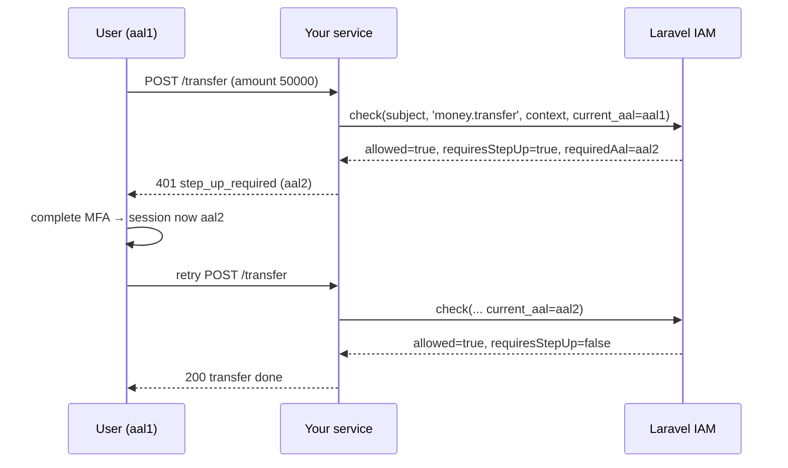

Not every grant is unconditional. A policy can say _"you may do this, but only if you've authenticated strongly enough."_ That conditional grant is modelled by **AAL** and **step-up**, and it's the reason the SDK distinguishes `allowed` from `granted`.

## AAL: Authenticator Assurance Level

**AAL** comes from [NIST SP 800-63B](https://pages.nist.gov/800-63-3/sp800-63b.html). It grades _how strongly_ a session authenticated:

| Level | Meaning (roughly) |
| --- | --- |
| `aal1` | Single factor — e.g. a password. |
| `aal2` | Multi-factor — e.g. password + TOTP/WebAuthn. |
| `aal3` | Hardware-backed multi-factor — phishing-resistant. |

Every decision query carries the caller's **current** assurance level as `currentAal` (default `aal1`). The PDP can require a higher level for sensitive actions — wiring money, deleting an org, exceeding an amount threshold.

## Why `allowed` is not `granted`

When the policy grants an action **but** the caller's `currentAal` is below what the action requires, the PDP returns:

```ts
{ allowed: true, requiresStepUp: true, requiredAal: 'aal2', … }
```

Read literally, `allowed` is `true` — the subject _is_ entitled to the action. But they're not entitled to perform it **right now**, at their current assurance. So the safe-to-act predicate is:

$$
\text{granted} \iff \text{allowed} \;\land\; \lnot\,\text{requiresStepUp}
$$

::: callout danger "Never gate on raw allowed"
`if (decision.allowed) doIt()` will perform a step-up-gated action **without** the step-up. Always gate on `iam.can()` / `isGranted(decision)`, which fold in `requiresStepUp`. The middleware does this for you.
:::

## How it flows through the SDK



## Driving a step-up challenge

When you need to react to step-up — rather than just deny — use `check()` and inspect the fields:

```ts
const d = await iam.check({
  subject: { id: userId },
  permission: 'money.transfer',
  context: { amount },
  currentAal: session.aal, // tell the PDP how strongly this session authenticated
});

if (d.requiresStepUp) {
  return res.status(401).json({ error: 'step_up_required', required_aal: d.requiredAal });
}
if (!d.allowed) {
  return res.status(403).end();
}
// granted — proceed
```

After the user completes the higher-assurance challenge, your auth layer raises the session's AAL; the retried request sends a higher `currentAal`, and the same policy now returns `requiresStepUp: false`.

## In the middleware

`requirePermission` treats a pending step-up as a denial (it's not `granted`), but it surfaces the distinction in the response so the client can react:

```json
{ "error": "step_up_required", "required_aal": "aal2", "decision_id": "dec_…" }
```

Use `onDeny` to turn that into whatever your client expects — a `401` with a challenge, a redirect to an MFA flow, a WebAuthn prompt:

```ts
requirePermission(iam, 'money.transfer', {
  currentAal: (req) => req.session.aal,
  onDeny: (req, res, d) =>
    d.requiresStepUp
      ? res.status(401).json({ challenge: d.requiredAal })
      : res.status(403).end(),
});
```

## ADR: model step-up as not-yet-granted, not as denied

::: collapsible "ADR — requiresStepUp is distinct from a flat deny"
**Problem.** A step-up requirement could be collapsed into a plain deny (`allowed: false`). That would be safe, but it loses information: the user _is_ entitled to the action and should be offered a challenge, not a dead end.

**Decision.** Preserve `allowed: true` alongside `requiresStepUp: true` and `requiredAal`, and define `granted` as `allowed && !requiresStepUp`. Gates use `granted` (so they fail closed), while richer callers can read `requiresStepUp`/`requiredAal` to drive a challenge.

**Consequences.** The safe path (gate on `granted`) and the friendly path (offer step-up) coexist without compromising safety: a caller that only checks `granted` still denies correctly; a caller that wants to upgrade the session has the data to do it. The cost is the ever-present footgun of reading raw `allowed` — mitigated by making `can()`/`isGranted` the obvious default and documenting it loudly.
:::

## Next steps

- [Fail-closed by design](/concepts/fail-closed) — why `granted` is the only safe gate.
- [Checking permissions](/guides/checking-permissions) — using `check`/`can`.
- [Express middleware](/guides/express) — `onDeny` and step-up responses.
