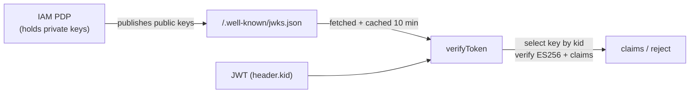

`verifyToken` decides whether a JWT is genuine, current, and meant for you. This page covers the theory: what ES256 proves, how JWKS distributes the verifying keys, which claims are checked and why, and the formal case for the SDK's most opinionated choice — a **mandatory audience**.

## What a verified token proves

A JWT is `header.payload.signature`, base64url-encoded. Verification establishes three independent properties:

1. **Authenticity** — the signature was produced by the holder of the issuer's private key (the PDP), so the payload wasn't forged.
2. **Integrity** — the payload hasn't been altered since signing; any tampering invalidates the signature.
3. **Validity** — the standardised claims place the token in time and scope: `iss` (who issued it), `aud` (who it's for), `exp` / `nbf` (when it's valid).

Authenticity + integrity come from the **signature**; validity comes from the **claim checks**. A token can be perfectly signed and still invalid (expired, wrong audience). Both must pass.

## ES256

Laravel IAM signs with **ES256** — ECDSA over the NIST P-256 curve with SHA-256. It's an **asymmetric** scheme: the PDP signs with a private key it never shares; verifiers check with the corresponding **public** key. That asymmetry is what lets your Node service verify tokens **without holding any secret** — it only needs the public key, published openly via JWKS.

The SDK pins the algorithm to `['ES256']`. Pinning matters: accepting "whatever `alg` the token declares" is the classic JWT vulnerability (the `alg: none` and RS/HS confusion attacks). By fixing ES256, a token that asks to be verified some other way is rejected outright.

## JWKS: distributing the public key

A **JWKS** (JSON Web Key Set) is a JSON document of public keys the issuer publishes at a well-known URL — here, `<origin>/.well-known/jwks.json`. Each key has a `kid` (key id); a token's header names the `kid` it was signed with, so the verifier selects the matching key from the set.



The SDK fetches the JWKS through its **own** `fetch` (honouring your timeout and any injected client), builds a local key set, and caches it for up to **10 minutes** so it isn't refetched per token.

### Key rotation

Issuers rotate signing keys periodically. During rotation the JWKS publishes both the old and new keys, and tokens may be signed by either. If verification fails specifically because **no cached key matches** the token's `kid` (`ERR_JWKS_NO_MATCHING_KEY` / `ERR_JWKS_MULTIPLE_MATCHING_KEYS`), the SDK refetches the JWKS **once** and retries — catching a key the cache hasn't seen yet. Any other failure (bad signature, expired, wrong audience) denies immediately, so a forged token can't trigger a refetch storm.

## The claim checks

After the signature verifies, the SDK checks:

| Claim | Check | Why |
| --- | --- | --- |
| `iss` | equals the expected issuer (default: `baseUrl` origin) | The token came from _your_ PDP, not another issuer. |
| `aud` | includes the expected audience (**required**) | The token was minted **for you**, not a sibling service. |
| `exp` | not in the past | The token hasn't expired. |
| `nbf` | not in the future | The token is already valid. |

`exp`/`nbf` are enforced by the underlying library; `iss`/`aud` are enforced against the values you supply (or the issuer the SDK derives).

## Why the audience must be mandatory

This is the SDK's most opinionated choice, and it's worth the formal argument.

**The vulnerability.** `jose.jwtVerify` **skips** the `aud` check entirely when no expected audience is passed. Consider a cluster where services share one issuer $I$ and one signing key. A token minted for service $A$ has `iss = I`, a valid signature, and `aud = A`. If service $B$ verifies it **without** specifying its own audience, then:

$$
\text{verify}_B(\text{token}_A) \;=\; \text{sig ok} \;\land\; (\text{iss} = I) \;\land\; \underbrace{\textsf{true}}_{\text{aud skipped}} \;=\; \textsf{accept}
$$

So $B$ accepts a token that was never meant for it — a **confused-deputy** escalation. The token holder, authorised only for $A$, now passes authentication at $B$.

**The fix.** Require an expected audience $\text{aud}_B$ and check membership:

$$
\text{verify}_B(\text{token}) \;=\; \text{sig ok} \;\land\; (\text{iss} = I) \;\land\; (\text{aud}_B \in \text{token.aud}) \;\land\; \text{time ok}
$$

Now $\text{token}_A$ (with `aud = A`, $A \neq B$) fails the membership check and is rejected. The SDK enforces this by **refusing to verify at all** when no audience is configured — absent audience is a verification failure, not an accept-any:

```ts
// inside verifyToken:
if (opts.audience === undefined) {
  throw new TokenVerificationError('audience is required: …');
}
```

::: callout danger "Absent audience is the dangerous default — so it's unreachable"
The whole point is that the library's most permissive behaviour (skip `aud`) can never be reached through this SDK. You either declare the audience or you get a rejection. There is no "verify without audience" path.
:::

## ADR: reject on missing audience instead of accept-any

::: collapsible "ADR — verifyToken requires an explicit audience"
**Problem.** The underlying verifier treats "no expected audience" as "accept any audience", enabling cross-service token replay within a shared-issuer cluster.

**Decision.** Treat a missing audience as a hard verification failure. Callers must set `verify.audience` (client default) or pass `options.audience`. The algorithm list is also pinned to `['ES256']`.

**Consequences.** The most dangerous default is structurally unreachable, and every call site must declare who a token is for — the correct posture. The cost is ergonomic: you cannot "just verify a token" without knowing your own audience. Given the severity of the confused-deputy failure, that friction is the right trade.
:::

## Gotchas

::: callout warning "The JWKS URL is the origin, not the API base"
`baseUrl` includes the `/api/iam/v1` prefix, but keys are served from the server **root**: `https://iam.example.com/.well-known/jwks.json`. The SDK derives this from the origin automatically. If your deployment serves JWKS elsewhere, set `verify.jwksUri` explicitly.
:::

::: callout warning "A rejection means nothing is trustworthy"
On a thrown `TokenVerificationError`, none of the token's claims are trustworthy — not even the ones you can decode. Treat the rejection as a hard deny; never fall back to reading the unverified payload.
:::

## Next steps

- [Verifying tokens (JWKS)](/guides/verifying-tokens) — the practical how-to.
- [Errors](/reference/errors) — `TokenVerificationError`.
- [Fail-closed by design](/concepts/fail-closed) — the invariant this upholds.
