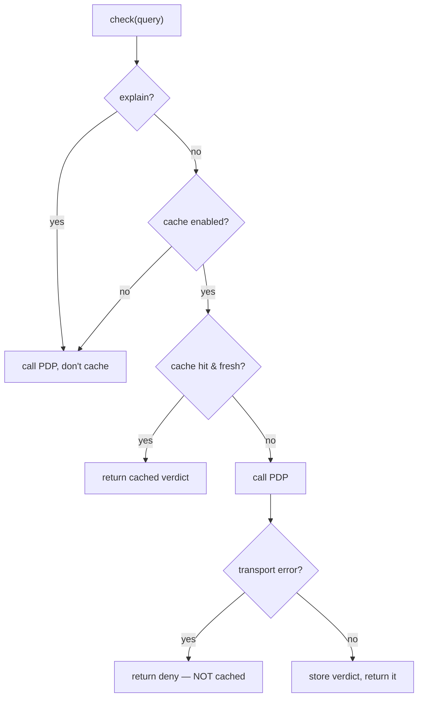

The decision cache is **opt-in and off by default**. When you enable it, the SDK caches the server's verdict for a short TTL, keyed on the full query — trading a little staleness for fewer PDP round-trips. It is built so that it can **never** turn a deny into an allow.

## Enabling it

```ts
const iam = new IamClient({
  baseUrl: 'https://iam.example.com/api/iam/v1',
  token: process.env.IAM_SERVICE_TOKEN,
  cache: { ttlMs: 5000, maxEntries: 1000 }, // ttlMs <= 0 disables; maxEntries default 1000
});
```

| Option | Default | Meaning |
| --- | --- | --- |
| `ttlMs` | `0` (disabled) | Time-to-live per entry, in ms. `<= 0` turns caching off. |
| `maxEntries` | `1000` | Cap on cached entries; oldest is evicted past the cap. |

## What it caches, and what it never caches

The cache stores the server's `Decision` **verbatim** under a stable hash of the query. It deliberately does **not** cache the things that would make it unsafe:

- **Never caches transport errors.** A synthetic deny (from a timeout / non-2xx / malformed body) is returned but **not** stored — it must not outlive the outage that caused it. The next call retries the server.
- **Never caches `explain` queries.** Reasoning must be fresh and is per-subject; explain queries bypass the cache on both read and write.
- **Only stores real verdicts.** Because errors are excluded, a cache hit is always a genuine server decision — it can never manufacture an allow.



## The cache key

The key is a **SHA-256** over a canonicalised JSON of the full wire payload — subject, permission, organization, application, resource, context, `current_aal`. Object keys are sorted recursively, so two logically-equal queries hash the same regardless of key order, and two **different** queries can never collide onto one verdict. This mirrors the PHP client's `DecisionRequest::cacheKey()`.

::: callout tip "Every input that can change the verdict is in the key"
Because `context` and `current_aal` are part of the key, a query with `{ amount: 300 }` and one with `{ amount: 9000 }` cache separately — you can't accidentally serve a low-amount allow to a high-amount request.
:::

## Policy-version invalidation

Each `Decision` carries the server's monotonic `policyVersion`. When a stored decision reports a **newer** version than the cache has seen, the cache **flushes everything** before storing the new entry. The reasoning: a policy change can flip any cached verdict, so nothing cached under the old policy can be trusted. The result is bounded staleness — at most `ttlMs`, and immediately zero across a policy bump.

## Eviction

Past `maxEntries`, the oldest inserted key is dropped to make room (a simple FIFO-ish bound). The cap keeps memory predictable in a long-running service handling many distinct subjects/resources.

## Choosing a TTL

The TTL is a **freshness vs. load** dial:

- **Short (1–5 s):** good for hot endpoints with repeated identical checks in a burst; revocations and grants propagate within seconds.
- **Longer (tens of seconds):** more load relief, but a freshly-revoked grant stays cached until the entry expires (or a policy bump flushes it).

Because the cache can only ever **shorten** the window in which a stale **allow** survives — and can never invent one — the risk is purely "a just-revoked allow lingers up to `ttlMs`". Size the TTL to your tolerance for that, and keep it small for sensitive permissions.

::: callout warning "A deny is never cached longer than the truth"
Transport-error denies aren't cached at all, and real denies are only cached for `ttlMs`. The cache can make a stale **allow** linger briefly; it cannot make a **deny** persist past a policy change or invent access. That asymmetry is the whole safety argument — see [Caching safely](/best-practices/caching-safely).
:::

## Next steps

- [Caching safely](/best-practices/caching-safely) — the deeper trade-offs and anti-patterns.
- [Fail-closed by design](/concepts/fail-closed) — the invariant the cache must not break.
- [IamClient API](/reference/client) — `CacheOptions` in context.
