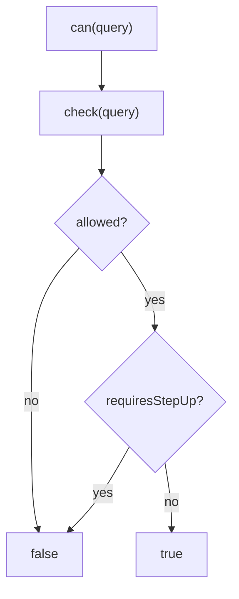

The core question this SDK answers is _"may this subject perform this permission (on this resource, in this context)?"_. Two methods answer it: `check()` (the full normalised decision) and `can()` (the fail-safe boolean).

## The query

```ts
const query = {
  subject: { type: 'user', id: 'usr_123' }, // id required; type defaults to 'user'
  permission: 'stock.adjust',                // the action being attempted
  application: 'warehouse',                  // which app's policy space (optional)
  organization: 'org_acme',                  // org scope (optional)
  resource: { type: 'warehouse', id: 'wh_milan' }, // the target object (optional)
  context: { amount: 300 },                  // free-form ABAC facts (optional)
  currentAal: 'aal1',                        // caller's assurance level (default 'aal1')
  explain: false,                            // ask for step-by-step reasoning (default false)
};
```

Only `subject.id` and `permission` are truly required. Everything else is optional and serialised with safe defaults (see [Wire contract](/architecture/wire-contract)).

## `check()` — the full decision

`check()` returns a normalised `Decision` and **never throws**:

```ts
const decision = await iam.check(query);

decision.allowed;         // boolean — the PDP's raw verdict
decision.requiresStepUp;  // boolean — allowed only at a higher AAL
decision.requiredAal;     // string | null — e.g. 'aal2'
decision.policyVersion;   // number
decision.decisionId;      // string — for audit correlation
decision.matched;         // DecisionMatch[]
decision.explanation;     // string[]
```

Use `check()` when you need the detail — to drive a step-up challenge from `requiredAal`, to log `decisionId`, or to surface `explanation` in a debug view.

## `can()` — the fail-safe boolean

Most call sites just want a yes/no. `can()` runs `check()` and reduces it to the **granted** boolean — `true` only when the PDP allowed **and** no step-up is pending:

```ts
if (!(await iam.can(query))) {
  return res.status(403).end();
}
```

This is the interpretation you should gate on. Never gate on raw `decision.allowed` — a step-up-pending decision has `allowed: true` but must be treated as not-yet-permitted.



## Subject shortcuts

A subject is `{ type?, id }`. `type` defaults to `user` on the wire, so for the common case you can write `{ id: 'usr_123' }`. Use an explicit `type` for service accounts, groups, or agents: `{ type: 'service', id: 'svc_sync' }`.

## Explain mode

Pass `explain: true` to ask the PDP for human-readable reasoning in `decision.explanation`. This is meant for debugging and admin tooling, not hot paths:

```ts
const d = await iam.check({ ...query, explain: true });
console.log(d.explanation); // ['matched role warehouse.operator', 'condition amount<=500 satisfied', …]
```

::: callout warning "Explain queries are never cached"
Even with the cache enabled, `explain: true` queries bypass it entirely — reasoning must be fresh and is not shared between subjects. Don't rely on explain in latency-sensitive code.
:::

## Fail-closed: what a deny really means

`check()` returns a deny in **all** of these cases, and they are indistinguishable to the caller by design:

- the PDP genuinely denied;
- the subject had no `id`;
- the request timed out or the network failed;
- the server returned a non-2xx status;
- the body was missing or unparseable.

That is the point: an unreachable PDP must produce exactly the same outcome as an explicit denial — **no access**. See [Fail-closed by design](/concepts/fail-closed).

If you need to distinguish "denied" from "couldn't reach the PDP" for observability, inspect `decision.explanation` (synthetic denies carry a short reason like `transport` or `no-subject`) — but **never** branch your authorization logic on that distinction.

## Worked example

```ts
import { IamClient } from '@padosoft/laravel-iam-node';

const iam = new IamClient({
  baseUrl: 'https://iam.example.com/api/iam/v1',
  token: process.env.IAM_SERVICE_TOKEN,
});

async function adjustStock(userId: string, warehouseId: string, amount: number) {
  const decision = await iam.check({
    subject: { type: 'user', id: userId },
    application: 'warehouse',
    permission: 'stock.adjust',
    resource: { type: 'warehouse', id: warehouseId },
    context: { amount },
  });

  if (decision.requiresStepUp) {
    throw new StepUpRequired(decision.requiredAal); // drive an MFA challenge
  }
  if (!decision.allowed) {
    throw new Forbidden(decision.decisionId);       // log the id for audit
  }

  // …safe to proceed…
}
```

## Next steps

- [Express middleware](/guides/express) / [Fastify middleware](/guides/fastify) — gate routes declaratively.
- [Step-up & AAL](/concepts/step-up-aal) — handle `requiresStepUp` properly.
- [Caching decisions](/guides/caching) — when and how to enable the cache.
