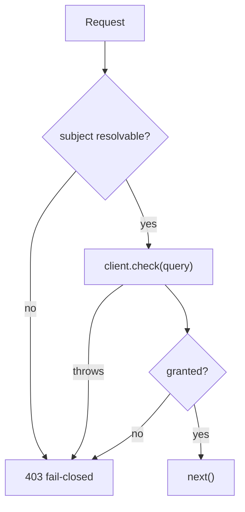

`requirePermission(client, permission, options?)` returns an Express-compatible middleware that asks the PDP before your handler runs. It is **fail-closed**: a missing subject, an unreachable PDP, or a pending step-up all respond **403** and never call `next()`.

## Minimal usage

```ts
import express from 'express';
import { IamClient } from '@padosoft/laravel-iam-node';
import { requirePermission } from '@padosoft/laravel-iam-node/middleware';

const iam = new IamClient({
  baseUrl: 'https://iam.example.com/api/iam/v1',
  token: process.env.IAM_SERVICE_TOKEN,
});

const app = express();
app.use(express.json());

app.post('/stock', requirePermission(iam, 'stock.adjust'), (req, res) => {
  res.json({ ok: true });
});
```

With no options, the subject is taken from `req.user.id` (falling back to `req.auth.sub`), and the check is sent with just the subject and permission.

## Resolvers

Each of `subject`, `resource`, `context`, `organization`, `application` and `currentAal` accepts either a **static value** or a **function of the request**. Functions are evaluated per request:

```ts
app.post(
  '/warehouses/:id/stock',
  requirePermission(iam, 'stock.adjust', {
    resource: (req) => ({ type: 'warehouse', id: req.params.id }),
    context: (req) => ({ amount: req.body.amount }),
    application: 'warehouse',
  }),
  stockHandler,
);
```

| Option | Resolves to | Default |
| --- | --- | --- |
| `subject` | `Subject \| string` | `req.user.id` ?? `req.auth.sub` |
| `resource` | `Resource \| string` | — (omitted) |
| `context` | `DecisionContext` | `{}` |
| `organization` | `string` | — |
| `application` | `string` | — |
| `currentAal` | `string` | server default (`aal1`) |
| `onDeny` | custom rejection handler | 403 JSON body |

A `subject` resolver returning a bare string is treated as `{ id: string }`. Anything `undefined` is simply omitted from the query.

## The default subject fallback

If you don't pass a `subject` resolver, the middleware reads the request in this order:

1. `req.user.id` (and `req.user.type` if present),
2. else `req.auth.sub`.

If neither yields a value, the request is denied with **403** — no subject means no decision. Put your authentication middleware (which populates `req.user` / `req.auth`) **before** `requirePermission`.



## The deny response

By default a denial responds **403** with a small JSON body and does **not** call `next()`:

```json
{ "error": "forbidden", "required_aal": null, "decision_id": "dec_…" }
```

When the denial is a pending step-up, `error` is `"step_up_required"` and `required_aal` carries the level the action needs — enough for the client to launch an MFA challenge. The body is sent via `res.json` (Express) or `res.send` (Fastify reply) — the middleware detects which exists.

## Custom rejection with `onDeny`

Override the response entirely — render a page, set a header, redirect to a step-up flow:

```ts
requirePermission(iam, 'stock.adjust', {
  onDeny: (req, res, decision) => {
    if (decision.requiresStepUp) {
      return res.status(401).json({ challenge: decision.requiredAal });
    }
    res.status(403).json({ error: 'nope', id: decision.decisionId });
  },
});
```

## The circular-context guard

`check()` is itself fail-closed, but building the cache key serialises `context` with `JSON.stringify`, which **throws on a circular object** _before_ any deny is produced. Left unguarded that throw becomes an unhandled rejection (Express 4 hangs the request; Express 5 / Fastify 500s) and silently bypasses the 403. The middleware wraps the `check()` call in a `try/catch` and converts any throw into a deny:

::: callout tip "Why this matters"
It means even a programming error in your `context` resolver — handing the SDK a request object with circular references — fails **closed** (403), not open. The guard is one of the small details that keep "fail-closed" true under real-world mistakes.
:::

## Full example

```ts
import express from 'express';
import { IamClient } from '@padosoft/laravel-iam-node';
import { requirePermission } from '@padosoft/laravel-iam-node/middleware';

const iam = new IamClient({
  baseUrl: 'https://iam.example.com/api/iam/v1',
  token: process.env.IAM_SERVICE_TOKEN,
  cache: { ttlMs: 3000 },
});

const app = express();
app.use(express.json());
app.use(myAuthMiddleware); // populates req.user = { id, type }

app.post(
  '/warehouses/:id/stock',
  requirePermission(iam, 'stock.adjust', {
    resource: (req) => ({ type: 'warehouse', id: req.params.id }),
    context: (req) => ({ amount: req.body.amount }),
    application: 'warehouse',
  }),
  (req, res) => {
    // reached only when the PDP granted (allowed AND no step-up)
    res.json({ ok: true });
  },
);

app.listen(3000);
```

## Next steps

- [Fastify middleware](/guides/fastify) — the same function on Fastify.
- [Middleware API](/reference/middleware) — every option, typed.
- [Step-up & AAL](/concepts/step-up-aal) — handling `step_up_required`.
