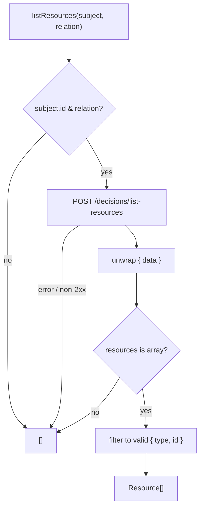

`listResources(subject, relation)` answers the **reverse** authorization question: instead of _"may this subject act on resource R?"_, it asks _"which resources does this subject have relation X to?"_. This is the **ReBAC** (Relationship-Based Access Control) list-objects query, added in the server's M16 milestone.

## When to use it

Point checks (`check`/`can`) gate a single action on a single resource. `listResources` is for **building filtered lists**: showing a user only the warehouses they can manage, the documents they can read, the projects they own — without round-tripping a `check()` per row.

```ts
const warehouses = await iam.listResources({ id: 'usr_123' }, 'manage');
// → [{ type: 'warehouse', id: 'wh_milan' }, { type: 'warehouse', id: 'wh_rome' }]
```

## Signature

```ts
listResources(
  subject: { type?: string; id: string },
  relation: string,
): Promise<Resource[]>
```

- `subject` — `{ type?, id }`; `id` required, `type` defaults to `user`.
- `relation` — the relationship name the server understands (e.g. `manage`, `owner`, `viewer`).
- Returns a list of `{ type, id }` resources.

It posts to `POST {baseUrl}/decisions/list-resources` (override via `listResourcesPath`), unwraps the `{ data }` envelope, and reads `data.resources`.

## Fail-closed: an empty list, never a guess

Like every method here, `listResources` is fail-closed — but its safe value is the **empty list**, not a deny verdict:

- a missing `subject.id` or `relation` → `[]`;
- any transport error, timeout, or non-2xx → `[]`;
- a malformed body, or `resources` that isn't an array → `[]`;
- entries that aren't `{ type: string, id: string }` are filtered out.



::: callout warning "An empty list is not proof of no access"
Because errors collapse to `[]`, an empty result can mean _"the subject relates to nothing"_ **or** _"the PDP was unreachable"_. That's the fail-closed trade: on uncertainty the user sees **fewer** resources, never more. Don't treat `[]` as a positive assertion that the subject has no relationships — treat it as "show nothing extra".
:::

## Use it to filter, then still gate on writes

`listResources` is ideal for read/display filtering. For **mutations**, still gate the specific action with `can()` — list-resources tells you what to show, a point check authorises what to do:

```ts
// List view: show only manageable warehouses
const visible = await iam.listResources({ id: userId }, 'manage');

// Write path: re-check the specific action on the specific resource
if (!(await iam.can({
  subject: { id: userId },
  permission: 'stock.adjust',
  resource: { type: 'warehouse', id: targetId },
}))) {
  return res.status(403).end();
}
```

This keeps display fast (one list call) while keeping each write authoritatively checked.

## Next steps

- [Checking permissions](/guides/checking-permissions) — the point-check counterpart.
- [The decision model](/concepts/decision-model) — how relations feed PDP verdicts.
- [IamClient API](/reference/client) — the full method reference.
