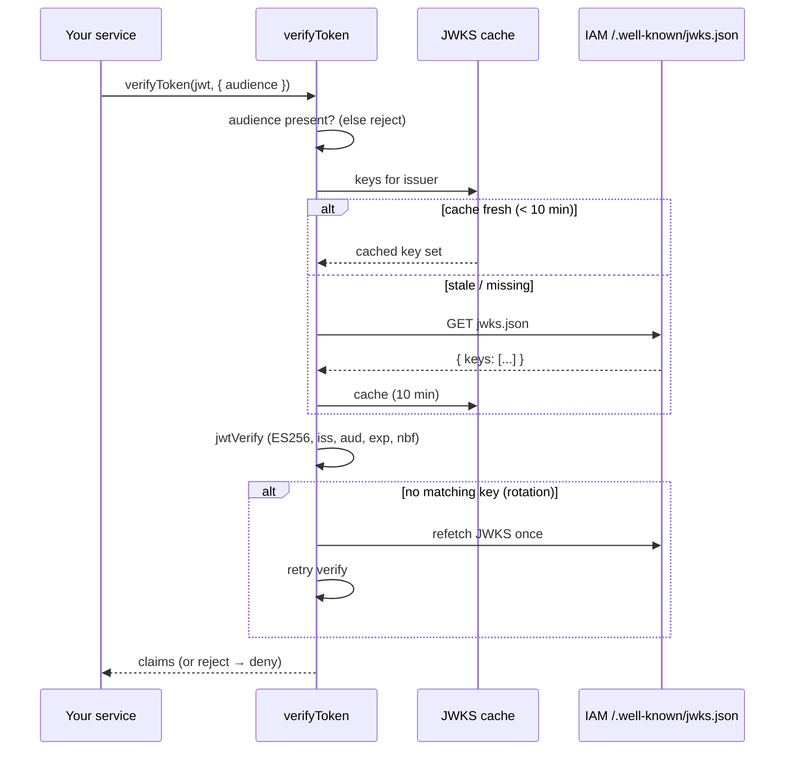

`verifyToken(jwt, options?)` answers the **authentication** question: _"is this token genuine, current, and meant for me?"_. It verifies the token's **ES256** signature and its `iss` / `aud` / `exp` / `nbf` claims against the server's published JWKS, then resolves to the verified claims — or **rejects**. A rejection is the fail-closed signal: treat it as deny.

## Basic usage

```ts
try {
  const claims = await iam.verifyToken(bearer, { audience: 'warehouse' });
  // trust claims.sub, claims.org, claims.scope, …
} catch {
  return res.status(401).end(); // fail-closed
}
```

`verifyToken` rejects with a `TokenVerificationError` on any failure: empty token, bad signature, wrong issuer, wrong audience, expired/not-yet-valid, JWKS unreachable, or malformed JWKS. You never get a "maybe" — it's verified claims or an exception.

## The mandatory audience

::: callout danger "No audience → reject"
`verifyToken` **refuses to run** if no `audience` is supplied — neither `verify.audience` on the client nor `options.audience` here. This is intentional and load-bearing.
:::

The underlying [`jose`](https://github.com/panva/jose) library **silently skips** the `aud` check when you don't pass an expected audience. In a cluster where many services share one issuer and one signing key, that means a token minted for service A (right issuer, right signature) would verify for service B. The SDK closes that hole by making audience required: absent audience is a verification failure, not an accept-any. See [Token verification theory](/concepts/token-verification) for the formal argument.

Set it once as a client default, override per call when a service accepts multiple audiences:

```ts
const iam = new IamClient({
  baseUrl: 'https://iam.example.com/api/iam/v1',
  verify: { audience: 'warehouse' }, // default for every verifyToken
});

await iam.verifyToken(jwt);                          // uses 'warehouse'
await iam.verifyToken(jwt, { audience: 'reports' }); // override
await iam.verifyToken(jwt, { audience: ['a', 'b'] }); // accept either
```

## Issuer and JWKS URI

Both are derived from `baseUrl` unless you override them:

| Setting | Default | Notes |
| --- | --- | --- |
| `issuer` | the **origin** of `baseUrl` (e.g. `https://iam.example.com`) | Expected `iss` claim. |
| `jwksUri` | `<origin>/.well-known/jwks.json` | Keys live at the server **root**, not under the `/api/iam/v1` prefix. |
| `audience` | — (**required**) | Expected `aud`; string or list. |

```ts
await iam.verifyToken(jwt, {
  audience: 'warehouse',
  issuer: 'https://iam.example.com',
  jwksUri: 'https://iam.example.com/.well-known/jwks.json',
});
```

## How verification flows



## Key rotation

JWKS are cached for up to **10 minutes** to avoid a fetch per token. When verification fails specifically because **no key in the cached set matches** the token's header (`ERR_JWKS_NO_MATCHING_KEY` / `ERR_JWKS_MULTIPLE_MATCHING_KEYS`) — the typical signature of a key rotation — the SDK refetches the JWKS **once** and retries. Any other failure (bad signature, expired, wrong audience) denies immediately without a refetch. This gives rotation exactly one chance and never turns into a refetch storm.

## What you get back

`Claims` is the verified JWT payload, with the standard OIDC fields typed and an index signature for the rest:

```ts
interface Claims {
  iss?: string; sub?: string; aud?: string | string[];
  exp?: number; nbf?: number; iat?: number;
  scope?: string; org?: string; client_id?: string; sid?: string;
  [k: string]: unknown;
}
```

Only trust these values **after** `verifyToken` resolves — a thrown `TokenVerificationError` means none of them are trustworthy.

## Worked example: an auth middleware

```ts
function authenticate(iam: IamClient, audience: string) {
  return async (req, res, next) => {
    const bearer = (req.headers.authorization ?? '').replace(/^Bearer /, '');
    try {
      const claims = await iam.verifyToken(bearer, { audience });
      req.user = { id: claims.sub, type: 'user' };
      next();
    } catch {
      res.status(401).end(); // fail-closed: any verification problem → 401
    }
  };
}
```

Chain this **before** `requirePermission` so the authorization middleware has a subject to work with.

::: callout warning "Don't catch and continue"
A `catch` that logs and calls `next()` anyway defeats the purpose — it lets unauthenticated requests through. Treat every rejection as a hard stop (401/deny).
:::

## Next steps

- [Token verification theory](/concepts/token-verification) — why audience is mandatory, formally.
- [Errors](/reference/errors) — the `TokenVerificationError` shape.
- [Fastify middleware](/guides/fastify) — verifying in an `onRequest` hook.
