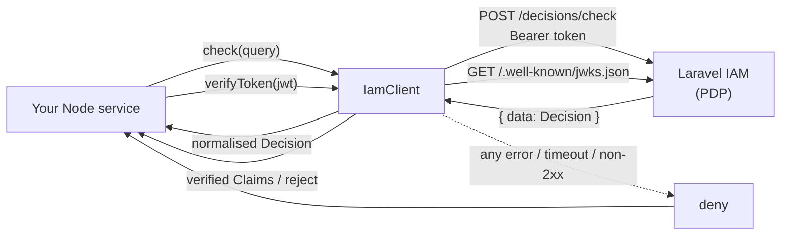

# laravel-iam-node

> **Ask the IAM server _"is this subject allowed to do this?"_ and verify its tokens — from any Node service, with the exact same wire contract and guarantees as the PHP client. No policy logic lives here: every decision is the server's.**

[](https://www.npmjs.com/package/@padosoft/laravel-iam-node)
[](https://github.com/padosoft/laravel-iam-node/actions/workflows/tests.yml)
[](https://github.com/padosoft/laravel-iam-node/blob/main/LICENSE)

`@padosoft/laravel-iam-node` is the **JavaScript/TypeScript SDK** for [Laravel IAM](https://github.com/padosoft) — an Identity & Authorization control plane (a **Policy Decision Point**, PDP) for multi-application ecosystems. Your non-PHP services still need to ask it for authorization decisions and verify the tokens it mints. This package is the thin, fail-closed client that does exactly that, and nothing more.

::: callout info "New here? Read this page top to bottom" icon:compass
In a few minutes you'll know what this SDK is, the one rule that governs everything it does (**fail-closed**), the two questions it answers (_may this subject act?_ and _is this token genuine?_), and where to click next. Every other page goes deeper — this one is the whole picture.
:::

---

## What it is — in one minute

A **PDP** is the component that owns authorization: your application asks _"is subject S allowed to do P on resource R?"_ and the PDP answers `allow` or `deny`. Laravel IAM is that PDP. The decision logic — RBAC roles, ABAC conditions, ReBAC relationships, step-up requirements — lives **entirely on the server**.

This SDK is a **thin client** over two server surfaces:

- **`POST {baseUrl}/decisions/check`** — the authorization question. You send a subject, a permission, an optional resource and context; you get back a normalised `Decision`.
- **JWKS token verification** — the authentication question. You hand it an access/ID token; it verifies the **ES256** signature and the `iss` / `aud` / `exp` / `nbf` claims against the server's published keys.

There is **no PDP logic in this package**. It never interprets a grant, never evaluates a policy, never decides anything locally. It serialises your query to the exact wire format the PHP client uses, calls the server, and normalises the answer. That is the entire job — and the discipline that keeps it safe.

> **In one line:** _the shortest path from "my Node service needs to honour our IAM" to "my Node service fails closed against our IAM" — same contract as PHP, zero policy duplication._

---

## The one rule: fail-closed

Everything in this SDK bends to a single invariant:

> **On any uncertainty — a network error, a timeout, a non-2xx response, a malformed body, a missing subject, an unverifiable token — the answer is `deny`. Never `allow`.**

There is no fail-open switch. An unreachable PDP must never open the doors. This is not a configuration default you can flip; it is the shape of the code. Read [Fail-closed by design](/concepts/fail-closed) for the full theory, threat model, and why the alternative is a latent outage-to-breach pipeline.

::: callout warning "`allowed === true` is not yet permission" icon:shield-alert
When a decision carries `requiresStepUp: true`, the action is only permitted at a higher assurance level — treat it as **not yet allowed**. Always reduce a decision through `iam.can()` / `isGranted()` for the fail-safe boolean. See [Step-up & AAL](/concepts/step-up-aal).
:::

---

## The two questions it answers

::: grids
  ::: grid
    ::: card "May this subject act?" icon:scale
    `check()` / `can()` ask the PDP `decisions/check`. You get a normalised `Decision` (`allowed`, `requiresStepUp`, `requiredAal`, `policyVersion`, `matched`, `explanation`). `can()` reduces it to the fail-safe boolean. **[Checking permissions →](/guides/checking-permissions)**
    :::
  :::
  ::: grid
    ::: card "Is this token genuine?" icon:key-round
    `verifyToken()` verifies an ES256 JWT against the server JWKS — signature, issuer, **mandatory audience**, expiry. Resolves to the claims or rejects (the fail-closed signal). **[Verifying tokens →](/guides/verifying-tokens)**
    :::
  :::
:::

---

## Why it's different

::: grids
  ::: grid
    ::: card "Fail-closed by construction" icon:lock
    Any network error, timeout, 5xx, 4xx, malformed body, or unverifiable token resolves to **deny** — never allow. No fail-open opt-out exists in the API surface.
    :::
  :::
  ::: grid
    ::: card "Drop-in parity with the PHP client" icon:git-compare
    Same endpoint, payload (`current_aal` snake-case, nulls included), Bearer auth, `{ data }` envelope unwrap and deny-on-error semantics as the PHP `HttpDecider` — the server can't tell the callers apart.
    :::
  :::
  ::: grid
    ::: card "Mandatory audience on tokens" icon:badge-check
    `verifyToken` refuses to run without an `audience`: `jose` silently skips the `aud` check when none is given, so a token minted for a sibling service would otherwise verify. Absent audience → reject, fail-closed.
    :::
  :::
  ::: grid
    ::: card "A cache that can't turn deny into allow" icon:database
    The opt-in decision cache stores the server's verdict verbatim, expires on a short TTL, never caches transport errors, skips `explain` queries, and flushes wholesale on a newer `policy_version`. Correctness before latency.
    :::
  :::
  ::: grid
    ::: card "Express & Fastify middleware" icon:route
    `requirePermission(iam, 'stock.adjust', …)` gates a route on a PDP permission. A missing subject, an unreachable PDP, or a pending step-up all respond **403** and never call `next()`.
    :::
  :::
  ::: grid
    ::: card "Zero heavy deps, ESM + CJS + types" icon:feather
    Native `fetch` (Node 18+) and [`jose`](https://github.com/panva/jose) for JWKS verification — that's the whole dependency tree. Ships ESM, CommonJS, and TypeScript declarations.
    :::
  :::
:::

---

## How it fits together

Your service asks; the SDK serialises and calls; the PDP decides; the SDK normalises and (for gates) reduces to a boolean. The verdict is always the server's.



---

## Start in 30 seconds

::: steps
1. **Install**
   ```bash
   npm install @padosoft/laravel-iam-node
   ```
   Requires Node 18+ (native `fetch`).

2. **Construct the client**
   ```ts
   import { IamClient } from '@padosoft/laravel-iam-node';

   const iam = new IamClient({
     baseUrl: 'https://iam.example.com/api/iam/v1', // full API base, incl. route prefix
     token: process.env.IAM_SERVICE_TOKEN,          // OAuth2 Client Credentials service token
   });
   ```

3. **Ask the PDP**
   ```ts
   if (!(await iam.can({
     subject: { type: 'user', id: 'usr_123' },
     application: 'warehouse',
     permission: 'stock.adjust',
     resource: { type: 'warehouse', id: 'wh_milan' },
   }))) {
     return res.status(403).end(); // fail-closed
   }
   ```
:::

**[→ Quickstart](/quickstart)** · **[→ Installation](/installation)** · **[→ Core concepts](/core-concepts)**

---

## Ecosystem

This SDK is one client in the **Laravel IAM** family. The server is the PDP; every other package is a way to consume or extend it.

::: grids
  ::: grid
    ::: card "laravel-iam-server" icon:server
    The IAM server: identity, org, Application Registry + manifest, PDP (RBAC + ABAC + ReBAC), OAuth/OIDC, tamper-evident audit, IGA, Admin API + panel. **[Docs →](https://doc.laravel-iam-server.padosoft.com)**
    :::
  :::
  ::: grid
    ::: card "laravel-iam-contracts" icon:file-code
    Shared contracts/interfaces + DTOs (PDP, KeyProvider, Assurance, FeatureScope). **[Docs →](https://doc.laravel-iam-contracts.padosoft.com)**
    :::
  :::
  ::: grid
    ::: card "laravel-iam-client" icon:plug
    The Laravel client for consumer apps: OIDC login, JWT/JWKS verify, introspection, `iam.auth`/`iam.can` middleware, Gate adapter, policy cache, webhook receiver. **[Docs →](https://doc.laravel-iam-client.padosoft.com)**
    :::
  :::
  ::: grid
    ::: card "laravel-iam-react-native" icon:smartphone
    React Native client SDK (`@padosoft/laravel-iam-react-native`), thin + hooks. **[Docs →](https://doc.laravel-iam-react-native.padosoft.com)**
    :::
  :::
  ::: grid
    ::: card "laravel-iam-rust" icon:cog
    Rust client SDK (crate `laravel-iam`), async + blocking, fail-closed. **[Docs →](https://doc.laravel-iam-rust.padosoft.com)**
    :::
  :::
  ::: grid
    ::: card "More modules" icon:boxes
    `laravel-iam-ai` (advisory-only AI), `laravel-iam-directory` (LDAP/AD), `laravel-iam-bridge-spatie-permission` (migration bridge). **[Org →](https://github.com/padosoft)**
    :::
  :::
:::

---

## Where to go next

::: grids
  ::: grid
    ::: card "Quickstart" icon:zap
    A working Express route gated on a PDP permission, end to end. **[Open →](/quickstart)**
    :::
  :::
  ::: grid
    ::: card "Fail-closed by design" icon:shield
    The invariant, the threat model, and why every error path funnels to deny. **[Read →](/concepts/fail-closed)**
    :::
  :::
  ::: grid
    ::: card "IamClient API" icon:book-marked
    Every constructor option and method, with exact types and behaviour. **[Reference →](/reference/client)**
    :::
  :::
:::

::: callout tip "Package facts" icon:info
npm `@padosoft/laravel-iam-node` · Node `>=18` · deps: `jose` only · ESM + CJS + types · MIT ·
[GitHub](https://github.com/padosoft/laravel-iam-node) · [npm](https://www.npmjs.com/package/@padosoft/laravel-iam-node)
:::
