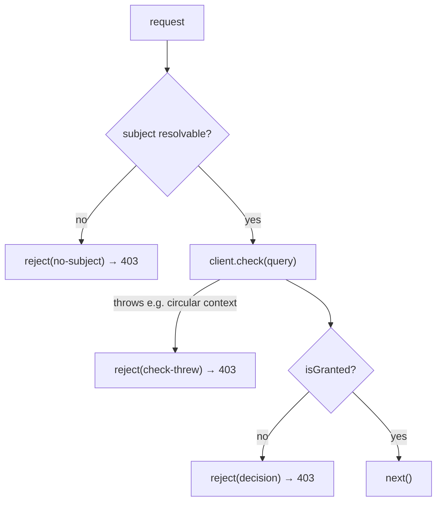

The middleware ships on the `./middleware` subpath:

```ts
import { requirePermission } from '@padosoft/laravel-iam-node/middleware';
```

## `requirePermission(client, permission, options?)`

Returns an `async (req, res, next)` middleware that gates a route on a PDP permission. Works on **Express** and **Fastify**. Fail-closed: a missing subject, an unreachable PDP, a thrown serialisation, or a pending step-up all respond **403** and never call `next()`.

```ts
app.post(
  '/warehouses/:id/stock',
  requirePermission(iam, 'stock.adjust', {
    resource: (req) => ({ type: 'warehouse', id: req.params.id }),
    context: (req) => ({ amount: req.body.amount }),
  }),
  handler,
);
```

| Param | Type | Notes |
| --- | --- | --- |
| `client` | `IamClient` | The configured client. |
| `permission` | `string` | The permission to require. |
| `options` | `RequirePermissionOptions` | Resolvers + `onDeny`. Optional. |

## Options (`RequirePermissionOptions`)

Each value field is a **`Resolver<T>`** — either a static `T` or a `(req) => T | undefined` evaluated per request. A function returning `undefined` omits that field from the query.

| Option | Resolves to | Default |
| --- | --- | --- |
| `subject` | `Subject \| string` | `req.user.id` (+ `req.user.type`), else `req.auth.sub` |
| `resource` | `Resource \| string` | — (omitted) |
| `context` | `DecisionContext` | `{}` |
| `organization` | `string` | — |
| `application` | `string` | — |
| `currentAal` | `string` | — (server default `aal1`) |
| `onDeny` | `(req, res, decision) => unknown` | built-in 403 JSON |

A `subject` resolved to a bare string becomes `{ id: string }`.

## The default subject fallback

When no `subject` resolver is given (or it returns nothing usable), the middleware reads:

1. `req.user.id` — with `req.user.type` carried through if present;
2. else `req.auth.sub`.

If neither yields a non-empty value, the request is denied **403** (`no-subject`). Mount your authentication middleware **before** `requirePermission` so `req.user` / `req.auth` is populated.

## Behaviour



1. Resolve the subject; if absent → 403.
2. Build the query from the resolvers and call `client.check`. The call is wrapped in `try/catch`: a serialisation throw (e.g. a **circular `context`**) becomes `reject('check-threw')`, not an unhandled rejection — so the gate can't be bypassed.
3. If the decision isn't `granted` (`allowed && !requiresStepUp`) → reject.
4. Otherwise → `next()`.

## The deny response

Default rejection sends **403** and does not call `next()`:

```json
{ "error": "forbidden", "required_aal": null, "decision_id": "dec_…" }
```

When the denial is a pending step-up, `error` becomes `"step_up_required"` and `required_aal` carries the needed level. The body is sent via `res.json` if present, else `res.send` (Fastify reply). The status is set via `res.status` if present, else `res.code`.

## Custom rejection (`onDeny`)

Provide `onDeny` to fully control the response — status, body, headers, redirect:

```ts
requirePermission(iam, 'money.transfer', {
  currentAal: (req) => req.session.aal,
  onDeny: (req, res, decision) => {
    if (decision.requiresStepUp) {
      return res.status(401).json({ challenge: decision.requiredAal });
    }
    res.status(403).json({ error: 'forbidden', id: decision.decisionId });
  },
});
```

`onDeny` receives the full `Decision`, so you can branch on `requiresStepUp`, surface `decisionId`, or render `explanation`.

## Request / response interfaces

The middleware depends on these **structural** shapes, not on Express or Fastify types:

```ts
interface MiddlewareRequest {
  user?: { id?: string | number; type?: string };
  auth?: { sub?: string };
  [k: string]: unknown;
}

interface MiddlewareResponse {
  status(code: number): MiddlewareResponse;
  json?(body: unknown): unknown;  // Express
  send?(body: unknown): unknown;  // Fastify reply
  code?(code: number): MiddlewareResponse; // Fastify reply
}
```

Any object satisfying these works — which is exactly how one function serves both frameworks. See [Express middleware](/guides/express) and [Fastify middleware](/guides/fastify).

## Next steps

- [IamClient API](/reference/client) — the client the middleware drives.
- [Types](/reference/types) — `Subject`, `Resource`, `DecisionContext`.
- [Step-up & AAL](/concepts/step-up-aal) — handling `step_up_required` in `onDeny`.
